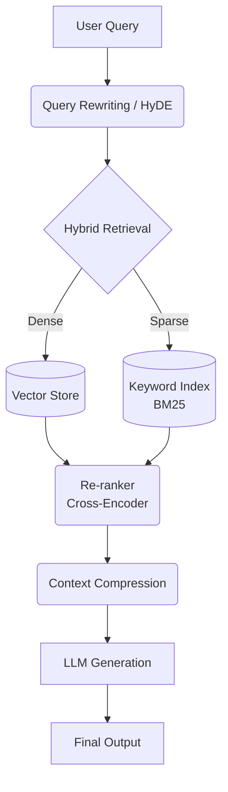

# Advanced RAG

Naive RAG embeds a query as-is and passes the raw top-K chunks straight to the LLM. Advanced RAG adds optimization steps **before** retrieval (to ask a better question) and **after** retrieval (to hand the LLM cleaner, more relevant context).

### Key Techniques
- **Query Rewriting / HyDE**: Rephrases or expands the user query, or generates a hypothetical answer, so the embedding better matches relevant chunks.
- **Hybrid Retrieval**: Combines dense (vector) search with sparse (keyword/BM25) search to catch both semantic and exact-term matches.
- **Re-ranker**: A cross-encoder model re-scores the merged candidate chunks for relevance, since retrieval embeddings alone are a coarse filter.
- **Context Compression**: Trims re-ranked chunks down to the sentences that actually matter, keeping the LLM's context window focused and reducing noise.
