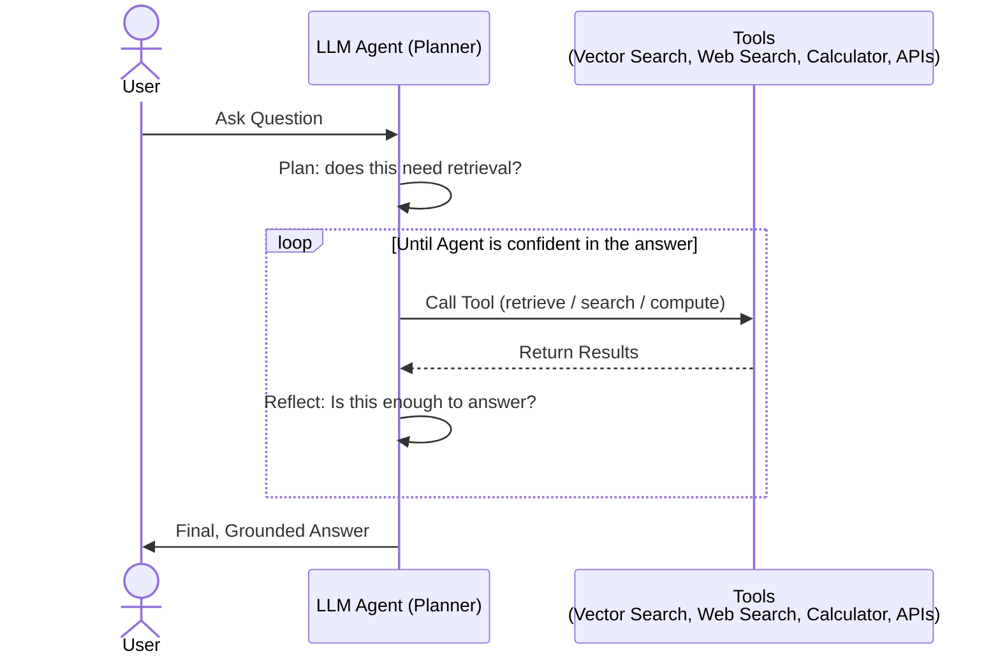

# Agentic RAG

Agentic RAG replaces the fixed retrieve-then-generate pipeline with an LLM agent that reasons about what to do next. The agent decides whether retrieval is even needed, which tool/source to query, and whether the gathered context is good enough to answer — looping and retrying before producing a final response.

### Key Techniques
- **Planner**: The LLM first decides if retrieval is necessary at all, and if so, formulates a retrieval plan (which tool, what query).
- **Tool Use**: The agent can call multiple distinct tools — vector search, web search, a calculator, external APIs — not just a single vector store.
- **Reflection Loop**: After each tool call, the agent evaluates whether it has enough grounded information; if not, it reformulates the query or picks a different tool and tries again.
- **Self-Correction**: Because the agent controls its own loop, it can recover from a bad first retrieval instead of committing to whatever the single initial search returned.
