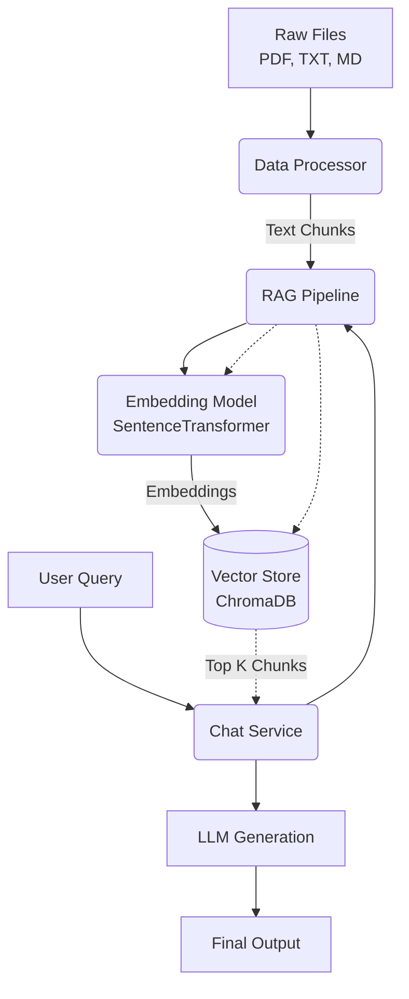

# System Architecture

The following diagram outlines the high-level architecture of the RAG system and how data flows through the various components.

### Component Details
- **Data Processor**: Parses raw files and chunks text.
- **RAG Pipeline**: Orchestrates ingestion and retrieval.
- **Embedding Model**: Runs a local `all-MiniLM-L6-v2` model to create vector representations.
- **Vector Store**: Uses ChromaDB to persist chunks and embeddings on disk.
- **Chat Service**: Interfaces with the LLM to generate grounded answers based on retrieved context.
