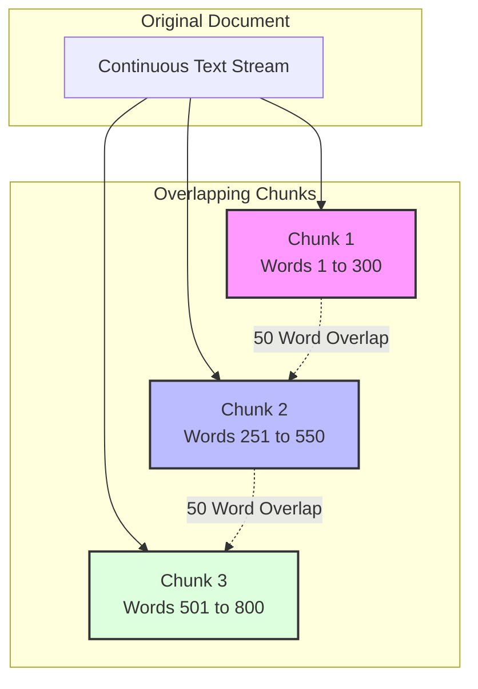

# Chunking Strategy

To efficiently retrieve relevant information and fit context within the LLM's context window limits, documents are split into smaller chunks.

### Strategy Details
- **Chunk Size**: 300 words
- **Overlap**: 50 words
- **Reasoning**: A 50-word overlap prevents sentences or specific semantic context from being abruptly cut in half across two chunks.

