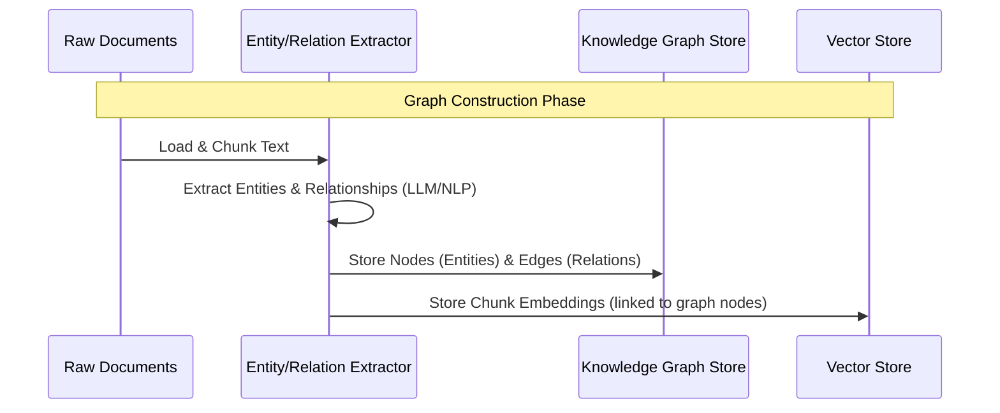
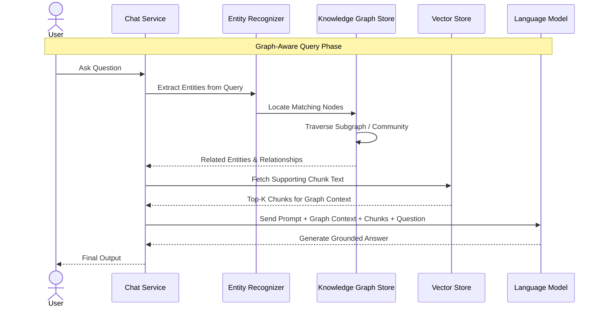

# Graph RAG

Graph RAG builds a knowledge graph of entities and relationships from the source documents, instead of (or alongside) a flat vector store. This lets retrieval follow relationships between facts — useful for multi-hop questions that plain chunk similarity search misses.

## 1. Ingestion Workflow

## 2. Retrieval & Generation Workflow

### Component Details
- **Entity/Relation Extractor**: Uses an LLM or NLP pipeline during ingestion to pull out entities (people, concepts, products) and the relationships between them.
- **Knowledge Graph Store**: Persists entities as nodes and relationships as edges, enabling traversal instead of only similarity lookup.
- **Entity Recognizer**: Identifies which entities the user's query is referring to, to anchor graph traversal.
- **Subgraph / Community Traversal**: Walks the graph outward from matched entities to gather related facts, then combines that with source chunk text for grounding.
