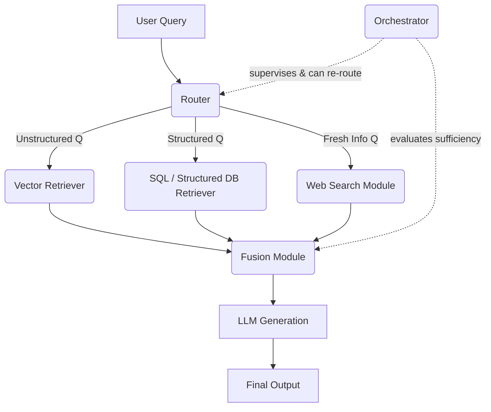

# Modular RAG

Modular RAG treats retrieval as a set of interchangeable modules instead of one fixed pipeline. A router decides, per query, which source(s) to consult (vector store, structured database, live web search, etc.), and an orchestrator can loop between modules before handing final context to the LLM.

### Key Techniques
- **Router**: Classifies the incoming query and picks the retrieval module(s) best suited to answer it.
- **Specialized Retrieval Modules**: Independent, swappable retrievers — vector search, SQL/structured lookups, web search, APIs — each optimized for its own data source.
- **Fusion Module**: Merges and deduplicates results pulled from multiple modules into a single context set.
- **Orchestrator**: Supervises the flow, can trigger another round of retrieval (different module or reformulated query) if the fused context is judged insufficient before generation.
