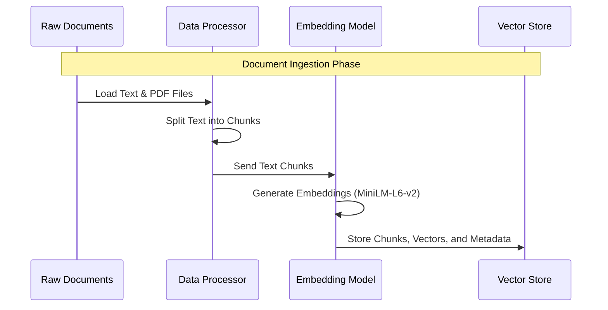
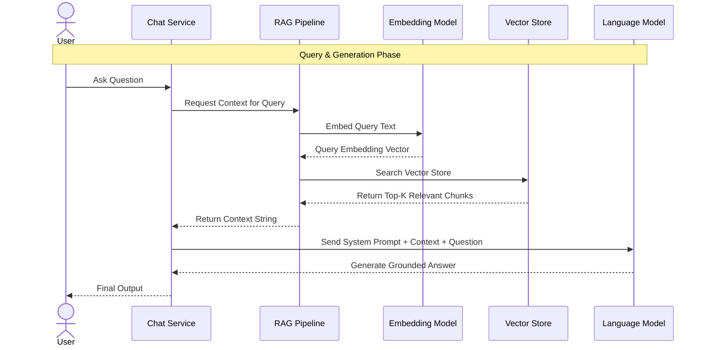

# RAG Workflows

The application workflow is divided into two distinct phases: **Ingestion** (processing files) and **Retrieval** (answering questions).

## 1. Ingestion Workflow

This process happens when documents are uploaded or indexed by the system.

## 2. Retrieval & Generation Workflow

This process happens when a user asks a question.

